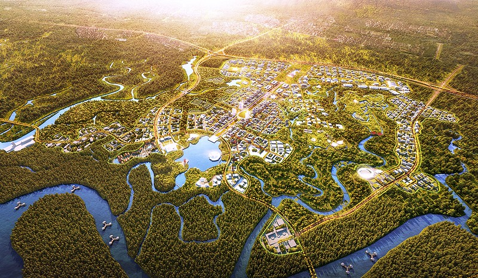
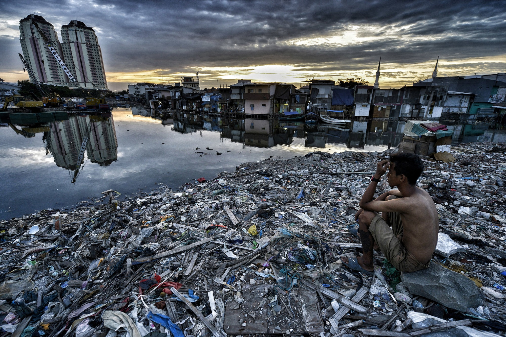
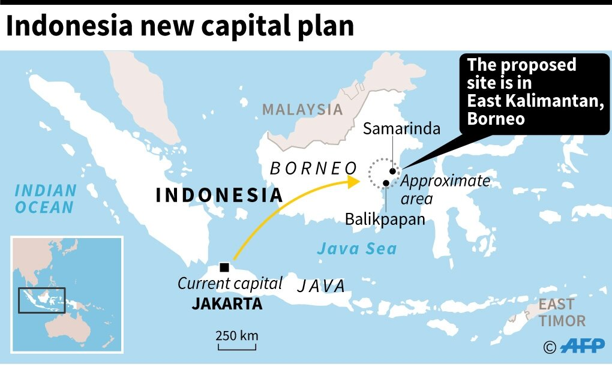

```{r setup, include=FALSE}
knitr::opts_chunk$set(echo = FALSE)
```

## Project Title:  Ibu Kota Negara - Transitioning to the Future


*Source: NBC News*

Hey everyone we are a team of Smart-City Management and Technology Majors from Singapore Management University! This website documents our journey through developing a report and proposing recommendations for Indonesia’s New National Capital Development Plan. Hope you enjoy it!

## Background: Jakarta and the need for change


*Source: Future Southeast Asia*

Jakarta, the current capital, is under threat. Being situated near the pacific ring of fire, it is often prone to earthquakes and other natural disasters. The city has also been plagued by excessive traffic congestion which has not only resulted in a spike in air pollution but decreased productivity as a nation. Furthermore, with global temperatures rising, Jakarta is at an ever increasing risk of flooding, which destroys infrastructure and homes. In addition, due to the lack of access to fresh water, illegal groundwater depletion has caused Jakarta to sink by an average of 10cm a year. This has given Jakarta the unofficial title as the “fastest sinking city in the world”.

The imminent dangers posed to the livelihoods of the city's 30 million people and the inevitable reality that Jakarta would eventually be submerged has the future of the city uncertain. This has spurred the search for a new site to replace Jakarta’s status as Indonesia’s capital.

## Motivation: East Kalimantan, Looking Ahead


*Source: Vietnam Plus*

Indonesia’s New National Capital Development Plan which was established towards the end of 2019 proposed that capital be shifted from Jakarta on the island of Java to East Kalimantan on the island of Borneo.

After doing in depth research, government officials concluded that part of Kutai Kartanegara Regency (Kabupaten Kutai Kartanegara) and Penajam North Paser Regency (Kabupaten Penajam Utara) in East Kalimantan will be carved out to create a new province-level planned city; nicknamed “Ibu Kota Negara” which directly translates to “New Capital”.This is a strategic and well informed decision due to the advantages that such a move would bring, namely: 

+ Allowing the capital to be located in a more central region of Indonesia and acting as a primary hub of activity and progress.
+ Presence of sizeable airports and seaports near the shortlisted sites
+ Relatively lower risks of natural disasters and forest fires

However as GIS analysts we understand that there are many things to consider before venturing into creation of new capital and we would like to offer our services to conduct a study into East Kalimantan to find a suitable location for ‘Ibu Kota Negara’.

