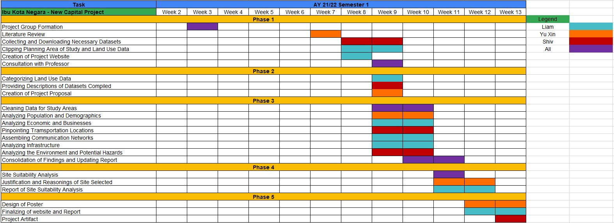

```{r setup, include=FALSE}
knitr::opts_chunk$set(echo = FALSE)
```
## 1	Project Objectives 

<h3>Produce a report of survey that conveys information on:</h3>

+ Population and Demographic
+ Economic and Business
+ Transport and Communication
+ Infrastructure 
+ Environment and Hazards

<h3>Identify a suitable location for the Ibu Kota Negara based on these features:</h3>

+ It should be between 4500-5500 hectares in size
+ It should avoid steep slope.
+ It should be away from potential natural disaster risk areas such as sea coasts, major rivers and volcanoes.
+ It should be near to current urban settlement areas but not at the current major settlement areas.
+ It should avoid natural forest as much as possible.
+ It should avoid areas prone to forest fire.
+ It should be highly accessible via road transport.
+ It should be near to airport(s) and seaport(s).


## 2	Data
  
<table class="pandoc-table">
<colgroup>
<col style="width: 25%">
<col style="width: 25%">
<col style="width: 25%">
<col style="width: 25%">
</colgroup>
<thead>
<tr class="header">
<th>Data Source</th>
<th>Name</th>
<th>Description</th>
<th>Link</th>
</tr>
</thead>
<tbody>
<tr class="odd">
<td>Indonesia Geospatial</td>
<td>BATAS DESA DESEMBER 2019 DUKCAPIL KALIMANTAN TIMUR</td>
<td>Village boundary and population data for East Kalimantan 2019</td>
<td><a href="https://www.indonesia-geospasial.com/2020/04/download-shapefile-shp-batas-desa.html" class="uri">https://www.indonesia-geospasial.com/2020/04/download-shapefile-shp-batas-desa.html</a></td>
</tr>
<tr class="even">
<td>Indonesia Geospatial</td>
<td>Geology Kalimantan Timur</td>
<td>Geology Shapefile of East Kalimantan</td>
<td><a href="https://www.indonesia-geospasial.com/2020/03/download-data-shapefile-shp-geologi-se.html" class="uri">https://www.indonesia-geospasial.com/2020/03/download-data-shapefile-shp-geologi-se.html</a></td>
</tr>
<tr class="odd">
<td>Indonesia Geospatial</td>
<td>KOTA BALIKPAPAN</td>
<td>Topographical data layers of Balikpapan City</td>
<td><a href="https://www.indonesia-geospasial.com/2020/01/shp-rbi-provinsi-kalimantan-timur.html" class="uri">https://www.indonesia-geospasial.com/2020/01/shp-rbi-provinsi-kalimantan-timur.html</a></td>
</tr>
<tr class="even">
<td>Indonesia Geospatial</td>
<td>KOTA SAMARINDA</td>
<td>Topographical data layers of Samarinda City</td>
<td><a href="https://www.indonesia-geospasial.com/2020/01/shp-rbi-provinsi-kalimantan-timur.html" class="uri">https://www.indonesia-geospasial.com/2020/01/shp-rbi-provinsi-kalimantan-timur.html</a></td>
</tr>
<tr class="odd">
<td>Indonesia Geospatial</td>
<td>KUTAI KARTANEGARA</td>
<td>Topographical data layers of Kutai Kartanegara Regency</td>
<td><a href="https://www.indonesia-geospasial.com/2020/01/shp-rbi-provinsi-kalimantan-timur.html" class="uri">https://www.indonesia-geospasial.com/2020/01/shp-rbi-provinsi-kalimantan-timur.html</a></td>
</tr>
<tr class="even">
<td>Indonesia Geospatial</td>
<td>OSM Buildings</td>
<td>Detailed building footprints throughout Indonesia</td>
<td><a href="https://www.indonesia-geospasial.com/2020/12/download-shp-pemukiman-detail-seluruh.html" class="uri">https://www.indonesia-geospasial.com/2020/12/download-shp-pemukiman-detail-seluruh.html</a></td>
</tr>
<tr class="odd">
<td>Indonesia Geospatial</td>
<td>PENAJAM PASER UTARA</td>
<td>Topographical data layers of Penajam Paser Regency</td>
<td><a href="https://www.indonesia-geospasial.com/2020/01/shp-rbi-provinsi-kalimantan-timur.html" class="uri">https://www.indonesia-geospasial.com/2020/01/shp-rbi-provinsi-kalimantan-timur.html</a></td>
</tr>
<tr class="even">
<td>Indonesia Geospatial</td>
<td>30. Provinsi Kalimantan Timur</td>
<td>Digital elevation model at 30m resolution</td>
<td><a href="https://www.indonesia-geospasial.com/2020/01/download-dem-srtm-30-meter-se-indonesia.html" class="uri">https://www.indonesia-geospasial.com/2020/01/download-dem-srtm-30-meter-se-indonesia.html</a></td>
</tr>
<tr class="odd">
<td>Indonesia Geospatial</td>
<td>Titik Api Hotspot se-Indonesia Tahun 2014 - 2019</td>
<td>Indonesia fire Hotspot data from 2014-2019</td>
<td><a href="https://www.indonesia-geospasial.com/2020/04/shapefile-shp-titik-api-hotspot.html" class="uri">https://www.indonesia-geospasial.com/2020/04/shapefile-shp-titik-api-hotspot.html</a></td>
</tr>
</tbody>
</table>

## 3 Scope of Work

> Delegation of work

## 4 Project Schedule
<style>
.aligncenter {
    text-align: center;
}
</style>
<p class="aligncenter">

</p>

{r layout="l-body-outset"}



