```{r setup, include=FALSE}
knitr::opts_chunk$set(echo = FALSE)
```
## 1. Study Area

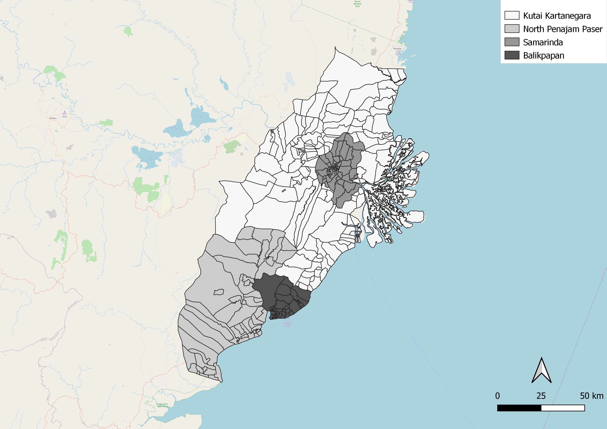

<p style="text-align:center"><em>Figure 1: Map of the chosen Study Area at scale 1:1270000 with OpenStreetMap (OSM) as a background layer.</em></p>

<p style="text-align: justify;">Our Study Area covers all sub-districts and districts of Kota Balikpapan, Kota Samarinda, and selected kecamatan (districts) and sub-districts of North Penajam Paser and Kutai Kartanegara Regencies. </p>

## 2. Survey of Indonesia’s New National Development Plan

<p style="text-align: justify;">Our first assignment is to survey Indonesia’s New National Development Plan, to have a deeper understanding of the features of the Study Area, including</p>

+ Population and Demographics
+ Economic and Business
+ Transport and Communication
+ Infrastructure 
+ Environment and Hazards

## 2.1 Population and Demographics

### 2.1.1 Population Density
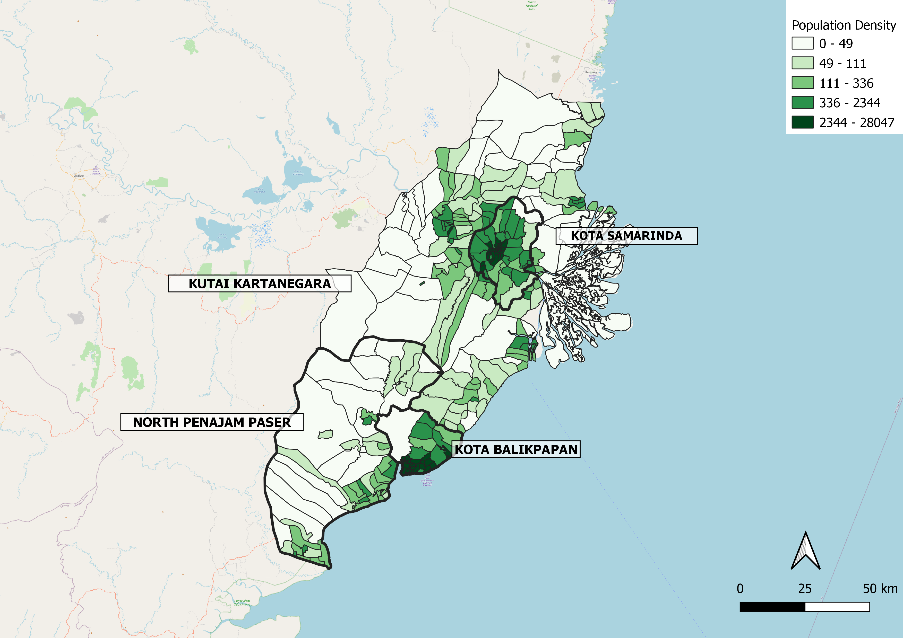

<p style="text-align:center"><em>Figure 2: Population density in each sub-district (1:1270000)
</em></p>

<p style="text-align: justify;">Figure 2 shows a choropleth map of the distribution of population density across East Kalimantan. We notice that sub-districts belonging to Samarinda and Balikpapan kota have noticeably higher relative densities in the study area surveyed. The above trends as observed in the choropleth map are likely as Balikpapan and Samarinda districts are among East Kalimantan’s most developed cities. Samarinda is known as East Kalimantan’s capital, and Balikpapan is home to various active seaports and airports. Given their perceived significance, it is reasonable for these locations to have relatively higher population numbers, namely through emigration of Indonesians from other sub-districts and foreigners who arrive in search of employment.  For North Penajam Paser and Kutai Kartanegara, sub-districts are generally much more sparsely populated than those within Balikpapan and Samarinda. These sub-districts are typically gazetted for agricultural use and hence are less densely populated.</p>

### 2.1.2 Marital Status
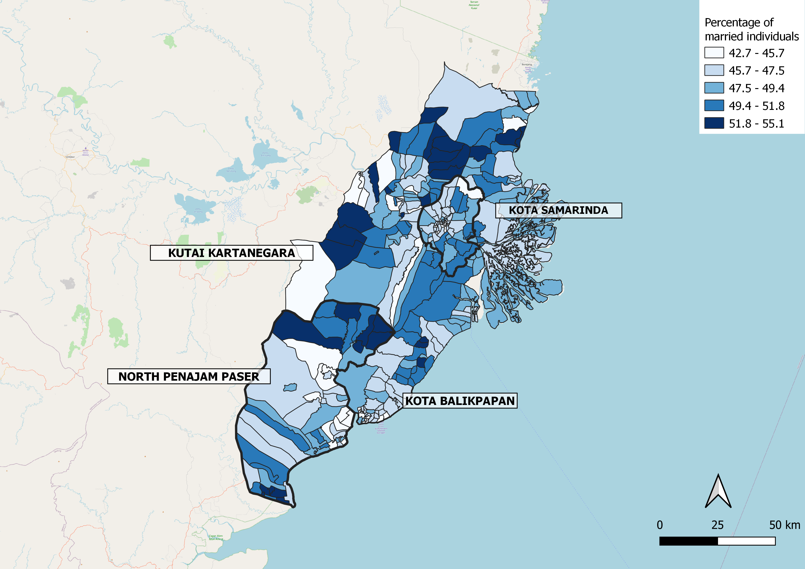

<p style="text-align:center"><em>Figure 3: Percentage of married individuals in each sub-district (1:1270000)
</em></p>

<p style="text-align: justify;">From Figure 3, we can see that the distribution of the average percentage of married individuals across the study area ranges from 42.7% to 55.1%. There seems to be a trend towards a lower percentage of married individuals in Kota Samarinda and Kota Balikpapan, which could be due to residents there having a greater focus towards advancing their careers, shifting priorities away from married life, which is typical of rapid urbanisation (Livingston, 2020). Notably, certain rural sub-districts such as Bumi Harapan and Sebakung Jaya in North Penajam Paser and Giri Agung and Suka Maju in Kutai Kartanegara have the greatest percentage of married individuals.</p>

### 2.1.3 Average Age
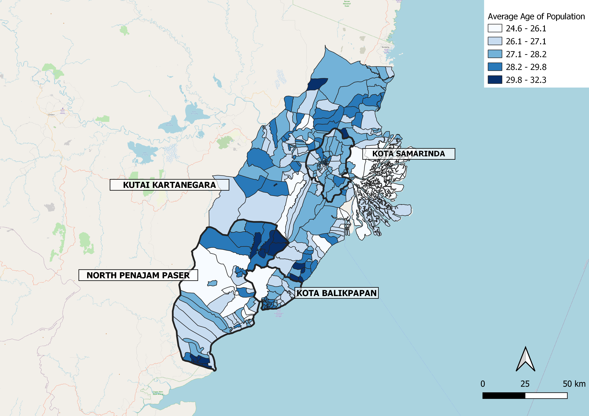

<p style="text-align:center"><em>Figure 4: Average age of population in each sub-district (1:1270000)
</em></p>

<p style="text-align: justify;">As seen in Figure 4, the distribution of the average age of residents differs by only a margin of less than 10 years, with the lowest average age being 24.6, and the highest being 32.3.</p>

<p style="text-align: justify;">As a developing region, it can be seen that East Kalimantan has a relatively young population, which bodes well for its economic future as a higher percentage of its population would be in the labour force. Furthermore, as the potential site for the new capital, the city can tap on this human resource to further spur the development and growth of Indonesia.</p>

### 2.1.4 Education
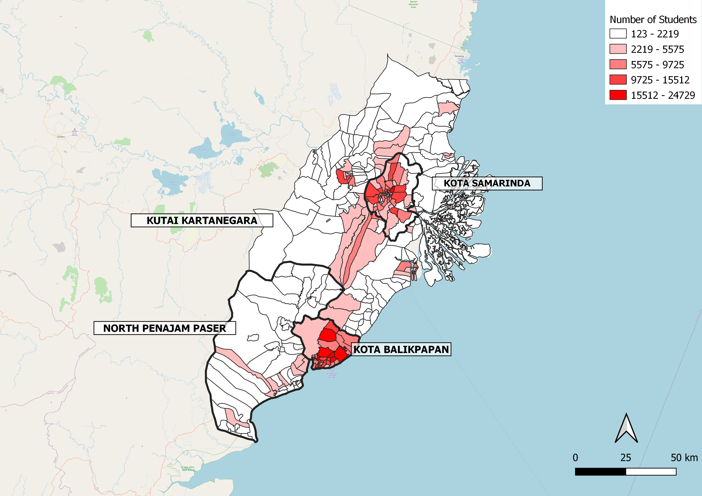

<p style="text-align:center"><em>Figure 5: Number of students in each sub-district (1:1270000)
</em></p>

<p style="text-align: justify;">From Figure 5, we can see that there is a more pronounced number of students enrolled in schools in Kota Samarinda and Kota Balikpapan, as compared to other sub-districts, with Graha Indah and Manggar in Balikpapan and Sungai Pinang Dalam in Samarinda among those with the highest enrolment of students. As relatively more developed regions within East Kalimantan, it is likely that there is greater emphasis on education and a higher procurement of schools within these sub-districts. This may lead to better access to educational services, which draws students who travel from less developed regions of East Kalimantan.</p>

### 2.1.5 Religion
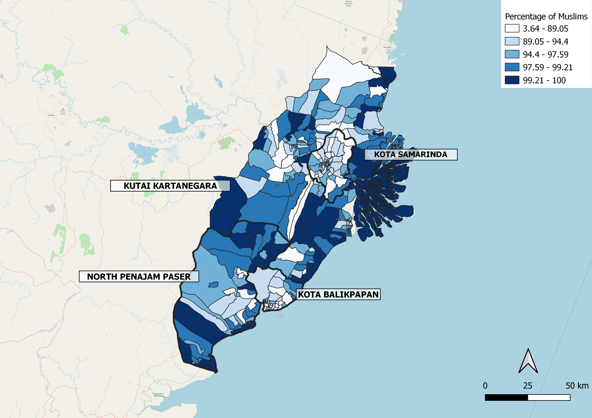

<p style="text-align:center"><em>Figure 6: Percentage of Musilms in each sub-district(1:1270000)
</em></p>

<p style="text-align: justify;">From Figure 6, we can tell that the vast majority of the people in East Kalimantan are Muslim, making up at least 90% of the population in most sub-districts. This is not a surprising as Indonesia is the most populous Muslim-majority country in the world (n.d.). For Kota Balikpapan and Kota Samarinda, the percentage of Muslims seem to be fewer than that in other sub-districts, with sub-districts such as Manggar and Sungai Nangka in Balikpapan, and Sempaja Timur and Bukuan in Samarinda among those with the lower percentages of below 90%.</p>

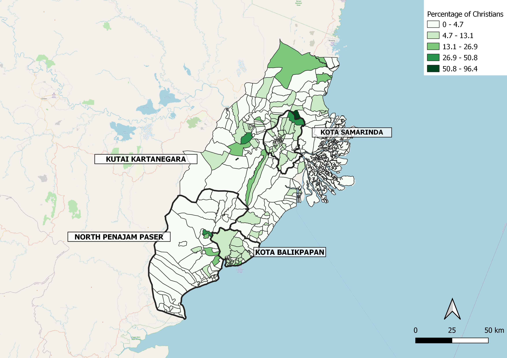

<p style="text-align:center"><em>Figure 7: Percentage of Christians in each sub-district (1:1270000)
</em></p>

<p style="text-align: justify;">As seen in Figure 7, the proportion of Christians across East Kalimantan are relatively low, with some of the highest proportions found in sub-districts of Budaya Pampang and Mangkupalas in Kota Samarinda, and Sungai Bawang right beside Kota Samarinda. There seems to be an observable inverse relationship between the percentage of Muslims as shown in figure 6 and the percentage of Christians within a subdistrict. Christianity in East Kalimantan has its roots in Indonesia’s colonial past, when much of the archipelago was controlled by the Dutch . During this period of time, christian missionaries tried to convert the local Dayak people of East Kalimantan, with varying degrees of success.</p>

### 2.1.6 Settlements
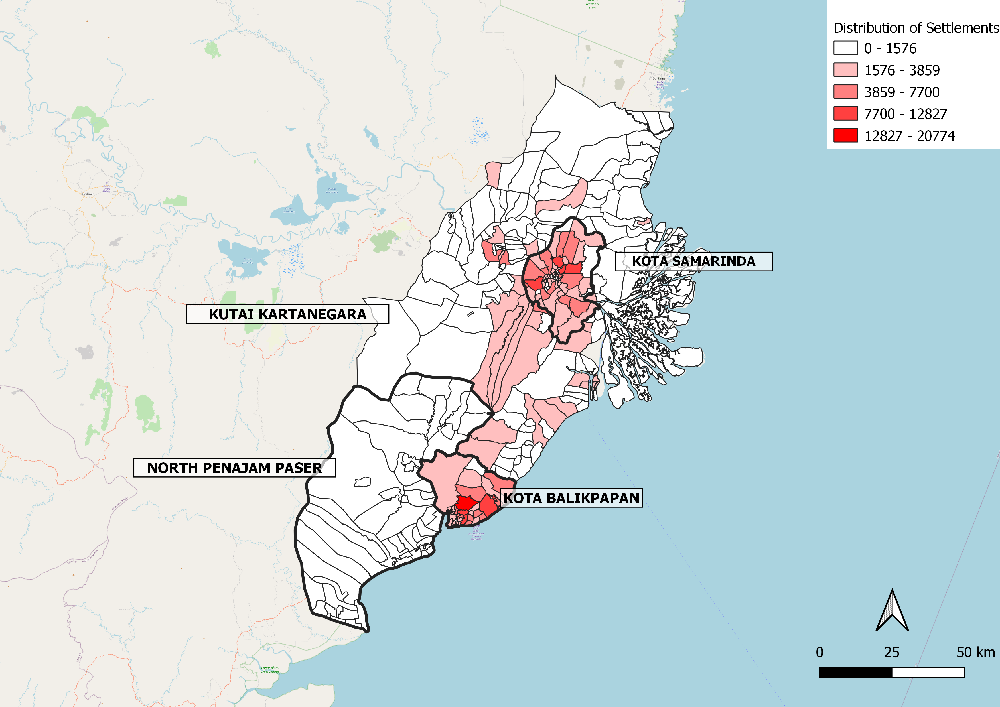

<p style="text-align:center"><em>Figure 8: Distribution of settlements in each sub-district (1:1270000)
</em></p>

<p style="text-align: justify;">As seen in Figure 8, the number of settlements within sub-districts appear to increase the closer they are located towards the two biggest cities in the study area, that being Kota Balikpapan and Kota Samarinda. The sub-districts with the highest concentration of settlements are Batu Ampar, Gunung Samarinda, Damai and Manggar with are located within Kota Balikpapan as well as Loa Bakung, Sempaja Selatan, Sungai Pinang Dalam and Mugirejo which are located within Kota Samarinda.</p>

<p style="text-align: justify;">The distribution of the number of settlements is similar to the distribution of population density described earlier, likely due to an increased need for housing in areas of higher population density.</p>

## 2.2 Economic and Business
<p style="text-align: justify;">TFor surveying economic and business activities, we decided to focus on locations of Banks, Trading Posts, Manufacturing Plants and Mining factories to give us a comprehensive understanding of the distribution of financial centres within the study area.</p>

### 2.2.1 Banks,Trading Post and Industries
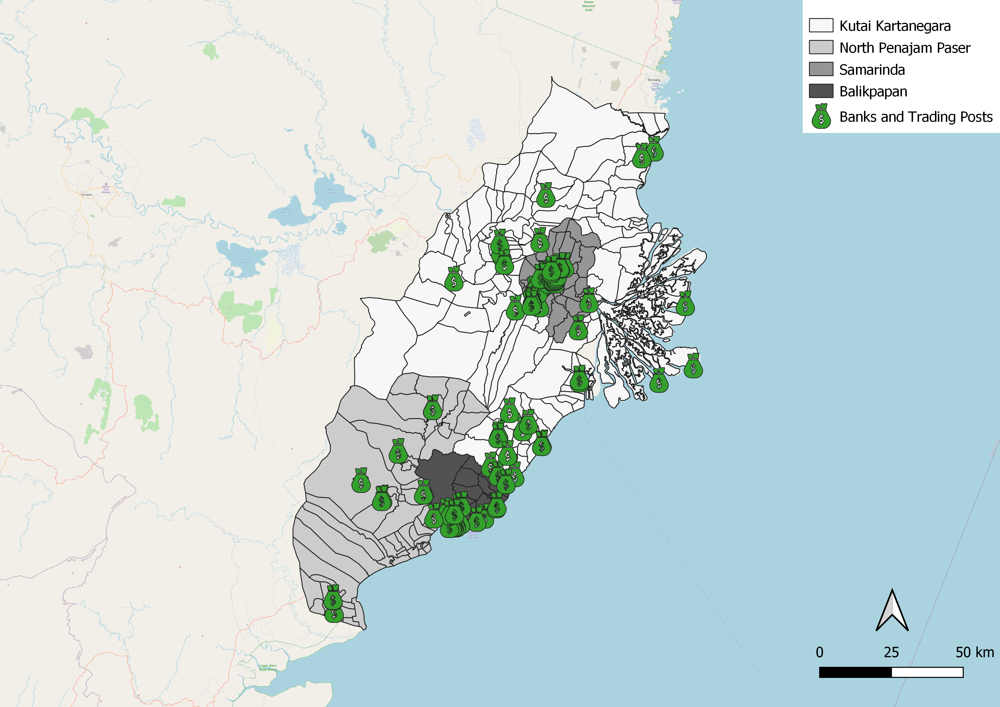

<p style="text-align:center"><em>Figure 9: Distribution of Banks and Trading Posts (1:1270000)
</em></p>

<p></p>
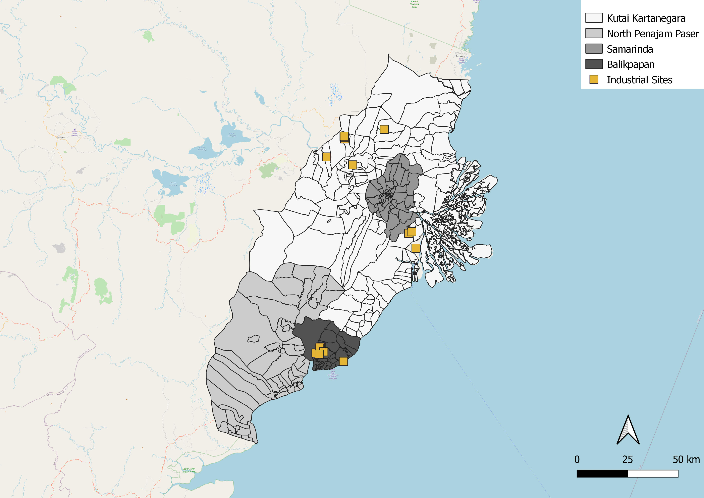

<p style="text-align:center"><em>Figure 10: Distribution of Industrial Sites (1:1270000)
</em></p>

<p> </p>
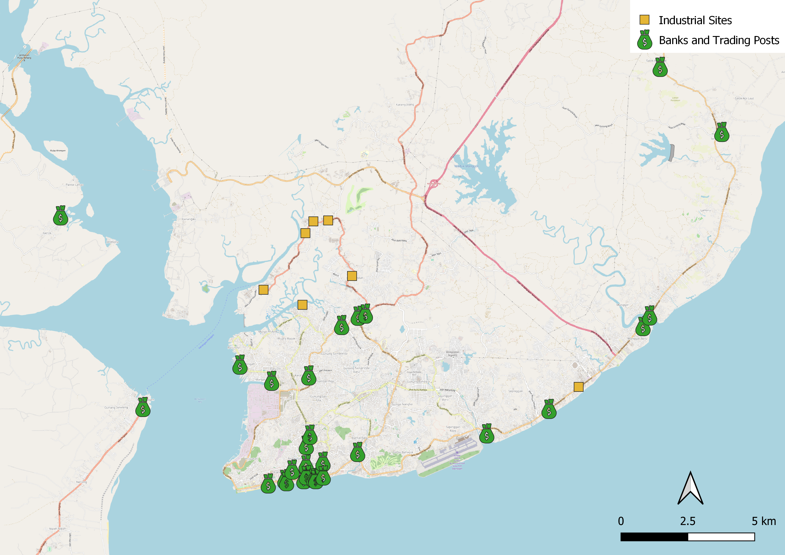

<p style="text-align:center"><em>Figure 11: Locations of Banks, Trading Posts and Industrial Sites within Kota Balikpapan (1:10000)
</em></p>

<p style="text-align: justify;">As seen in Figure 9 and Figure 11, locations of Banks and Trading Posts within the study area occur in high concentrations in sub-districts such as Kariangu, Klandasan Ulu and Klandasan Ilir within Kota Balikpapan in the south. They also are concentrated in sub-districts such as Pelabuhan, Air Putih and Simpang Tiga within Kota Samarinda in the centre of the study area.</p>

<p style="text-align: justify;">As seen in Figure 10 and Figure 11, key industrial sites are located in sub-districts like Kariangu and Batu Ampar within Kota Balikpapan and in sub-districts which surround the periphery of Kota Samarinda further north and in the centre of the study area.</p>

<p style="text-align: justify;">This comes as no surprise as Balikpapan and Samarinda are the two largest cities in the province of East kalimantan. Balikpapan in particular is known as the Oil City of Indonesia (Banua Patra) and has the largest economy within Kalimantan having a Gross Domestic Product of 73.18 Trillion Rupiah.</p>

### 2.2.2 Mining, Oil and Gas
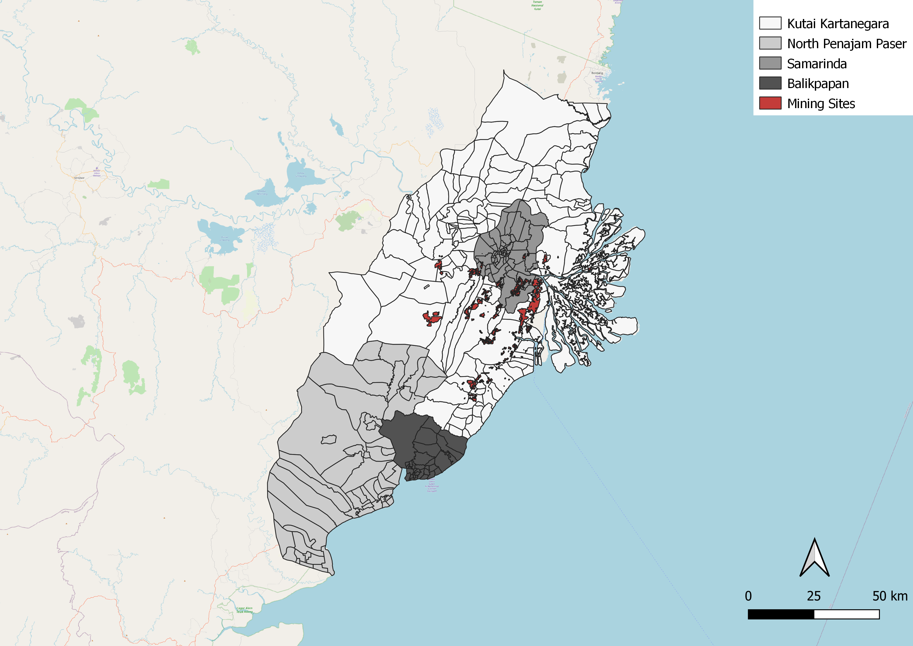

<p style="text-align:center"><em>Figure 12: Distribution of Mining Sites. (1:1270000)
</em></p>

<p> </p>
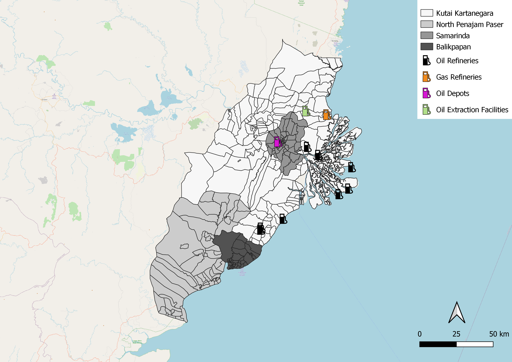

<p style="text-align:center"><em>Figure 13: Map showing distribution of Oil and Gas Production Facilities
</em></p>

<p style="text-align: justify;">Mining activities also play an important role in the economy of East Kalimantan, accounting for upwards of 30% of its total GDP (2021). As seen in Figure 12, Mining Sites are spread out across the central districts of the study area, often overlapping multiple sub-districts. </p>

<p style="text-align: justify;">Crude oil and natural gas production make up a smaller but still significant proportion of East Kalimantan’s GDP, contributing about 6% to 7% annually (2021). As seen in Figure 13, locations of oil and natural gas production are concentrated in the western areas and central regions of the study area. There are also plans in the works to build three new oil and gas rigs off the coast of East Kalimantan, which would undoubtedly provide a much needed boost to its economy (Harsono, 2020).</p>

<p style="text-align: justify;">With new and upcoming developments, the economy of East Kalimantan seems poised to grow and expand.</p>

## 2.3 Communication
<p style="text-align: justify;">To understand the distribution of communication facilities within the study area, we decided to focus on the aggregated locations of Radio stations, Television Stations and Telephone Towers.</p>

### 2.3.1 Distance from Communication Installations
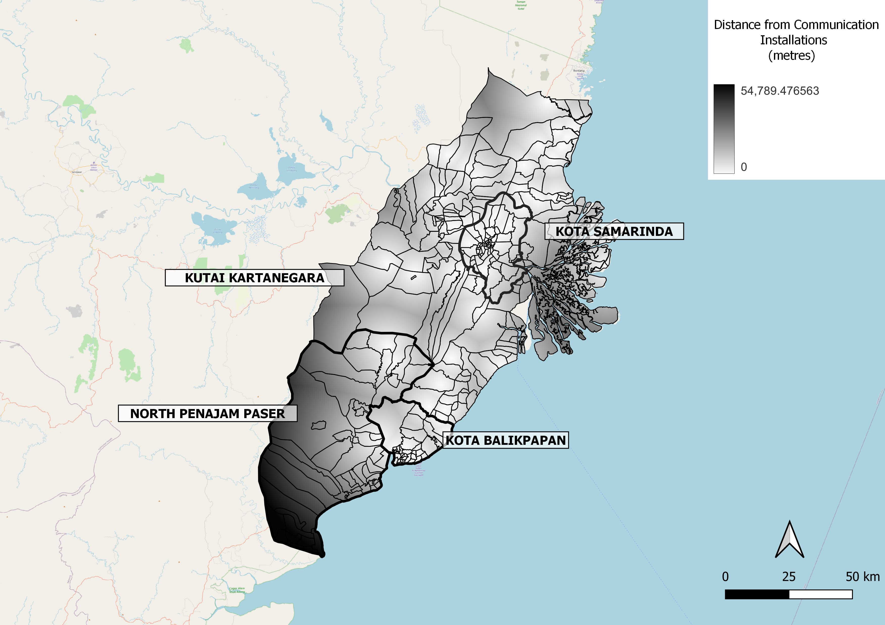

<p style="text-align:center"><em>Figure 14: Distance from Communication Installations Heatmap (1:1270000)
</em></p>

<p style="text-align: justify;">As in Figure 14, the sub-districts that are very well connected and close to communication Installations appear to be  Lok Bahru, Pelabuhan, Bukit Pinang, Sempaja Timur and Mugirejo which are all located within Kota Samarinda. The distance from communication installations across sub-districts also seem to increase in a successive manner as we move outwards and away from the Kota Samarinda and Kota Balikpapan. sub-districts like Labangka, Babalu Laut and Rintik in the southern tip of North Penajam Paser also appear to be poorly serviced and very far away from community installations, making them less connected. However one reason for this is that they could be serviced by other communication installations that are not within the scope of the study area.</p>

### 2.3.2 Communication Installations in Kota Samarinda


<p style="text-align:center"><em>Figure 15: Locations of Communication Installations within Kota Samarinda (1:10000)
</em></p>

<p style="text-align: justify;">Kota Samarinda is the capital city of East Kalimantan on the island of Borneo. It also ranks first on the East Borneo Human Development Index (2021). In addition to that it is also the most populous city in Borneo with a population of 827,994 at the 2020 Census (2021). </p>

<p style="text-align: justify;">In lieu of its large population and highly developed city network, sub-districts within Samarinda would be better serviced with Communication facilities as compared to other sub-districts in the study area. As seen on Figure 15, we should also note that Kota Samarinda is also home to Aji Pangeran Tumenggung Pranoto International Airport which could be another factor which results in the high provisioning of communication installations in its adjacent sub-districts.</p>

## 2.4 Infrastructure
<p style="text-align: justify;">For the purpose of surveying the distribution of infrastructure within the study area, we have chosen to focus on the location of water refineries, bridges, electricity towers and electricity stations.</p>

### 2.4.1 Infrastructure as a whole
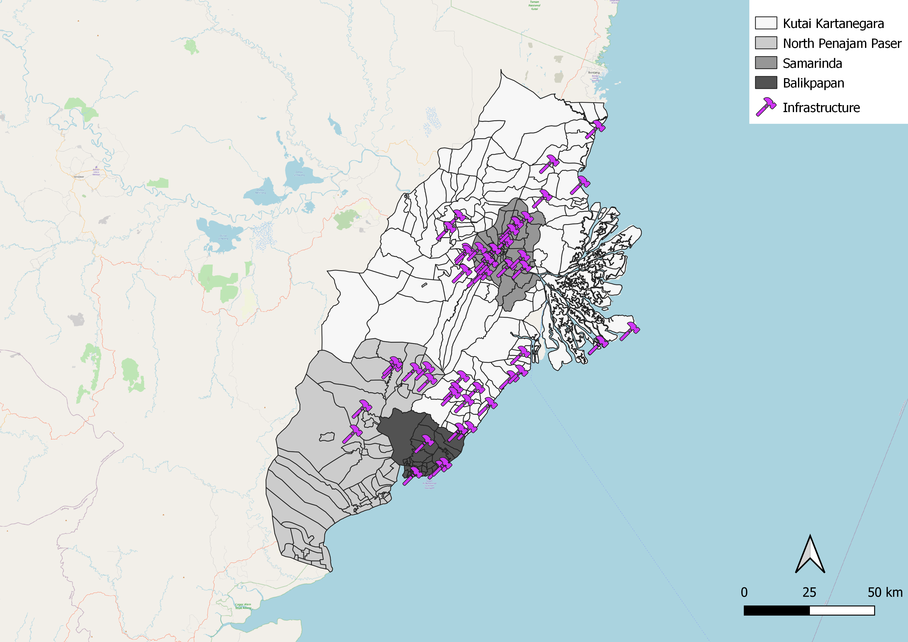

<p style="text-align:center"><em>Figure 16: Distribution of Infrastructure (1:1270000)
</em></p>

<p style="text-align: justify;">For the purpose of surveying the distribution of infrastructure within the study area, we have chosen to focus on the location of water refineries, bridges, electricity towers and electricity stations.</p>

<p style="text-align: justify;">As seen in Figure 16, there is more infrastructure present in sub-districts that surround and are within the two major cities of Kota Balikpapan and Kota Samarinda, which could be due to the built up natures of the two areas, housing much of the urban development in East Kalimantan.</p>

### 2.4.2 Water Refineries
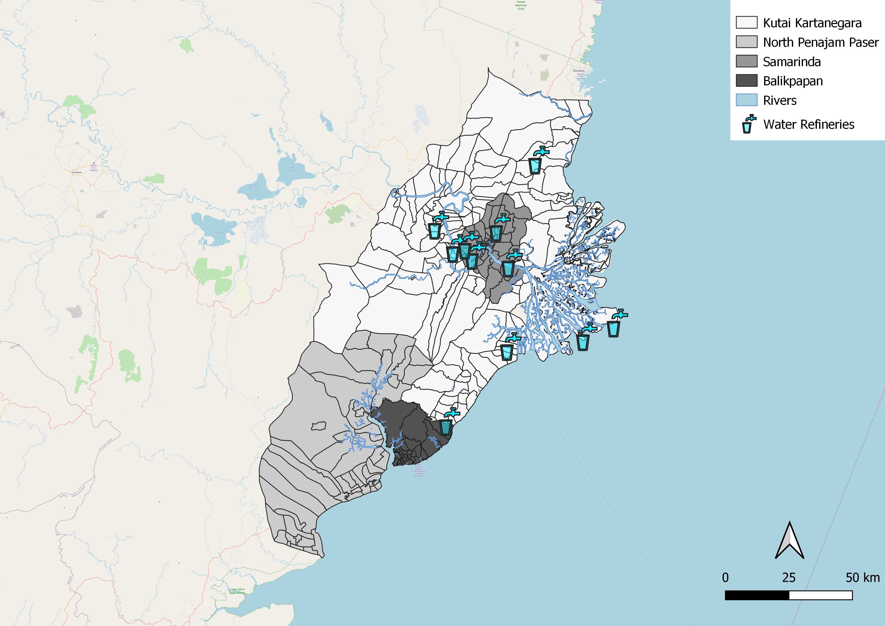

<p style="text-align:center"><em>Figure 17: Distribution of Water Refineries (1:1270000)
</em></p>

<p style="text-align: justify;">As seen in Figure 17, Water refineries within the study area are close to coastlines and Major rivers that run through the heart of Kota Samarinda. This makes sub-districts like Loa Kulu Kota and Loa Bakung that straddle the waterways ideal locations for water refineries which help to supply clean water to other sub-districts in East Kalimantan. There are also two major salt water treatment plants located in Sepatin on the west coast of East Kalimantan, which helps to supply fresh water to villages and settlements in the region (Fitriyadi, 2014). Their location is indicated by the two rightmost water refineries on Figure 17.</p>

### 2.4.3 Electricity
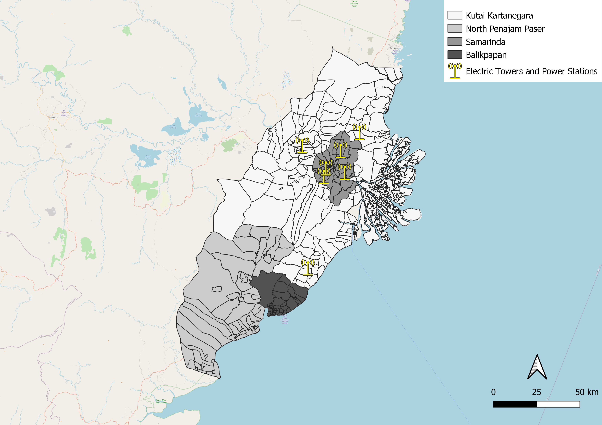

<p style="text-align:center"><em>Figure 18: Distribution of Electricity Towers and Power Stations (1:1270000)
</em></p>

<p style="text-align: justify;">As seen in Figure 18, most of the electricity production happens in sub-districts within or surrounding Kota Samarinda with one located in Sungai Seluang, which is close to Kota Balikpapan. Since Kota Balikpapan and Kota Samarinda are the most urbanized areas in East Kalimantan they would indeed have a greater need for electricity to power the cities’ utilities. However this may also indicate a large disparity in other areas of East Kalimantan, which are relatively underdeveloped and may not have a steady supply of electricity.</p>

## 2.5 Transportation
### 2.5.1 Road Networks
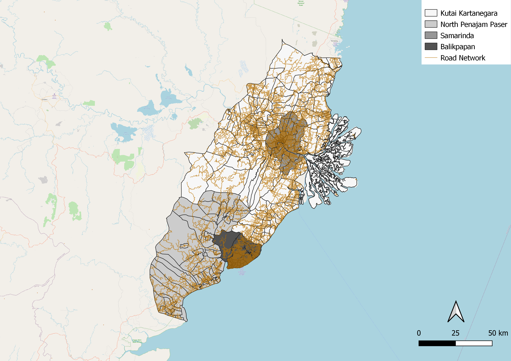

<p style="text-align:center"><em>Figure 19: Distribution of Road Networks (1:1270000)
</em></p>

<p style="text-align: justify;">An extensive road network is present across the study area, with the North Penajam  Paser Regency having the lowest density of roads and streets. Since Samarinda and Balikpapan are major economic hubs in East Kalimantan, they both expectedly have the highest density of roads and streets. </p>

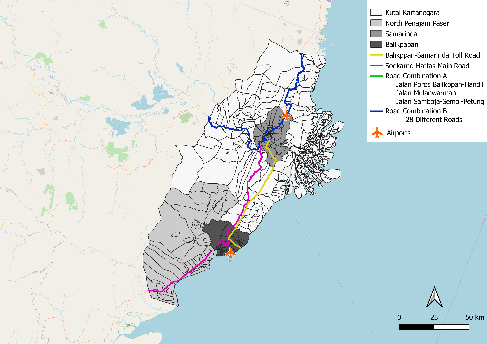

<p style="text-align:center"><em>Figure 20: Distribution of Main Roads (1:1270000)
</em></p>

<p style="text-align: justify;">These are the four major roads that stretch across our study area.</p>

<p style="text-align: justify;">The 99.3km Balikpapan-Samarinda Toll Road is a newly built highway, completed in April 2020. It was built to improve connectivity between Samarinda and Balikpapan and ease congestion on other existing highways linking the two cities. Additionally, this toll road ends at Jalan Mulawarman mainroad which directly links with the Balikpapan airport, therefore allowing areas along the toll road access to the airport fast and conveniently.</p>

<p style="text-align: justify;">The Soekarno-Hattas Main Road links all four regencies, starting from Samarinda, going across Kutai Kartanegara and then through Balikpapan and finally ending at North Penajam Paser. (Note: There is a small gap on the Soekarno-Hatta Main Road between Balikpapan and North Penajam Paser on the map due to the presence of a water body. A ferry service transports vehicles across the water body.)</p>

<p style="text-align: justify;">Even though not reflected in the above map, it is interesting to note that a 203km  single track railway project, currently in the preparation stage, has been planned for the North Penajam Paser, Balikpapan and West Kutai Kartanegara Regencies to support coal jetties, seaports, and coal fired power plants (2019).</p>

### 2.5.1 Airports and Seaports
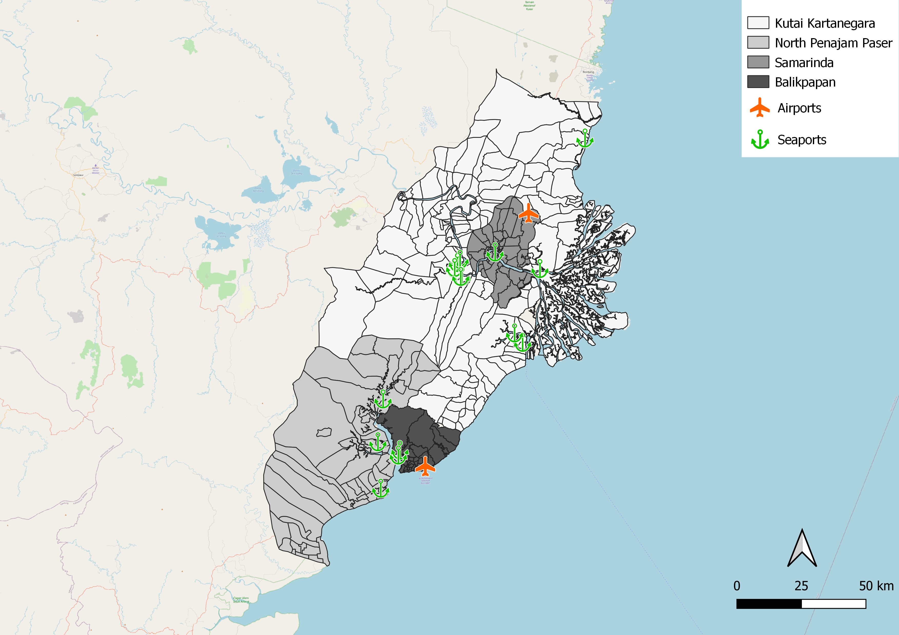

<p style="text-align:center"><em>Figure 21: Distribution of Airports and Seaports (1:1270000)
</em></p>

<p style="text-align: justify;">The study area consists of two airports, one in Balikpapan Regency and another in Samarinda Regency. Kutai Kartanegara and North Penajam Paser do not have airports of their own. As shown in Figure 21, these airports are well accessible by major main roads.</p>

<p style="text-align: justify;">On the other hand, the study area consists of 14 sea ports, suggesting that more of the economic activities taking place here involve the transport of goods (such as coal and chemicals). </p>

## 2.6 Environment and Hazards
### 2.6.1 Earthquakes
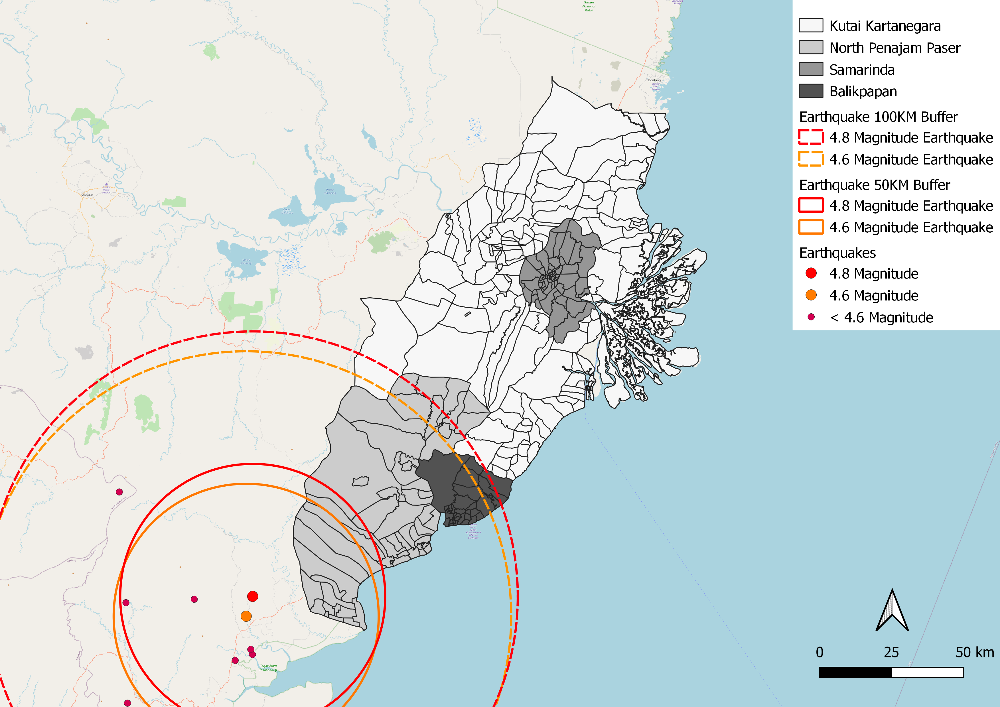

<p style="text-align:center"><em>Figure 22: Location of Earthquake Epicentres (1:1270000)
</em></p>

<p style="text-align: justify;">The above map shows the two epicentres of the earthquakes that had occurred close to our study area in the past, one with a magnitude of 4.6 and another with a magnitude of 4.8. There were several other earthquakes that occurred in the same area in the past but since they were of a magnitude of less than 4, they were considered insignificant.</p>

<p style="text-align: justify;">The intensity of the recent 6.0 earthquake near Sinabang in April 2021, according to USGS, became insignificant at causing damage (2021) at about 100km from the epicentre (MMI at 4) . The furthest damage reported was about 96km from the epicentre.  (Xinhua, 2021) Taking that into consideration, since they both likely have similar geological conditions, if such an earthquake were to occur at the same epicentres shown in the map, 100km tremor buffers of the epicentres do overlap with a large part of the North Penajam Paser Regency in our study area.</p>

<p style="text-align: justify;">However, the probability of earthquakes occurring in this area is very low, considering that only 9 took place near the study area, out of the over 30, 100 that took place across Indonesia between 1970 and 2021 (USGS), which gives us a very low probability of 0.0003. To add on, this is nowhere near the pacific ring of fire as well.</p>

### 2.6.2 Forests
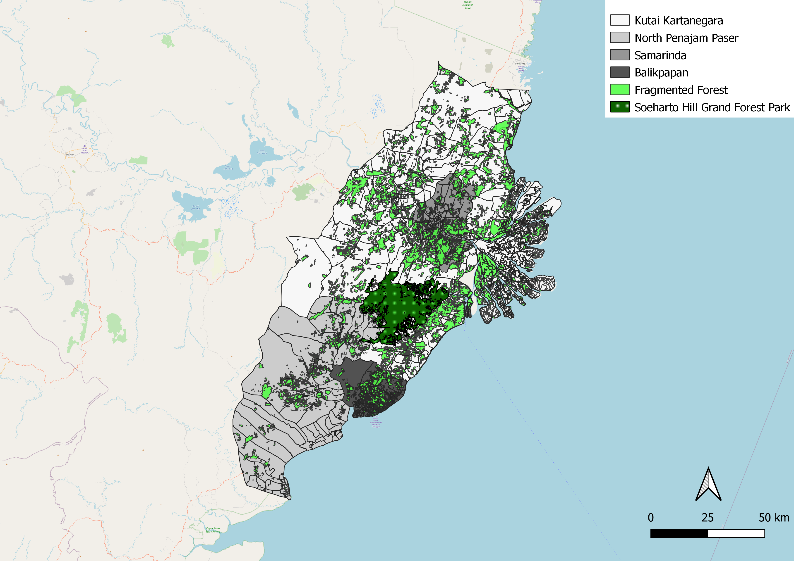

<p style="text-align:center"><em>Figure 23: Distribution of Forests (1:1270000)
</em></p>

<p style="text-align: justify;">The darker green patch in the middle of the map is the “Taman Hutan Raya Bukit Soeharto” which translates to Soeharto Hill Grand Forest Park. The forest overlaps with the Loa Janan Sub-District, Kutai Kartanegara Regency and Sepaku Sub-District, North Penajam Paser Regency. It is a reserve forest, and has not gone through any developments or slated for developments.</p>

<p style="text-align: justify;">Apart from that, Forest Fragmentations are spread across the study area . They are fragmented to this extent due to the logging, forest fires or other economic activities which is a common occurrence in East Kalimantan. </p>

### 2.6.3 Forest Fires
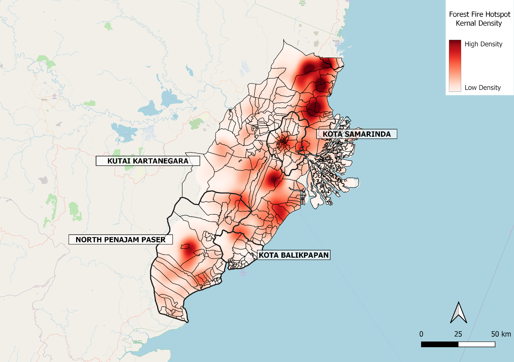

<p style="text-align:center"><em>Figure 24: Forest Fire Heatmap (1:1270000)
</em></p>

<p style="text-align: justify;">Out of all the regencies, northern Kutai Kartanegara Regency has the highest density of forest fires. The effects of this are reflected in the forest map, in which the forests are fragmented heavily in the same area. This is likely due to farmers clearing vegetation for the lucrative palm oil trade or even for pulp and paper plantations using the slash-and-burn method. .</p>

<p style="text-align: justify;">Forest fires occur often in the Samarinda Regency as well, but since it is a built up area, these fires are likely accidental ones and are not due to any economic activities.</p>