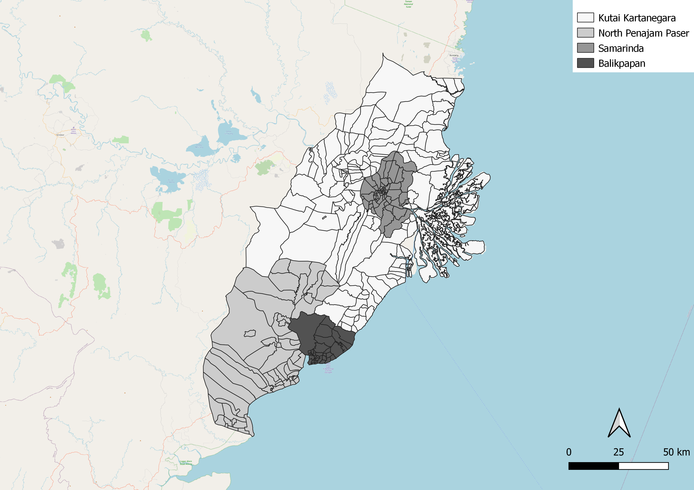

```{r setup, include=FALSE}
knitr::opts_chunk$set(echo = FALSE)
```

<a href="https://docs.google.com/document/d/1tGaDd11ZTlXejogHfq9jgltYw5pbw-H0iCk6k3hhJFE/edit">Report</a>

## 1.1 Study Area



<p style="text-align:center"><em>Figure 1: Map of the chosen Study Area at scale 1:1270000 with OpenStreetMap (OSM) as a background layer.</em></p>

<p style="text-align: justify;">Our Study Area covers all sub-districts and districts of Kota Balikpapan, Kota Samarinda, and selected kecamatan (districts) and sub-districts of North Penajam Paser and Kutai Kartanegara Regencies </p>