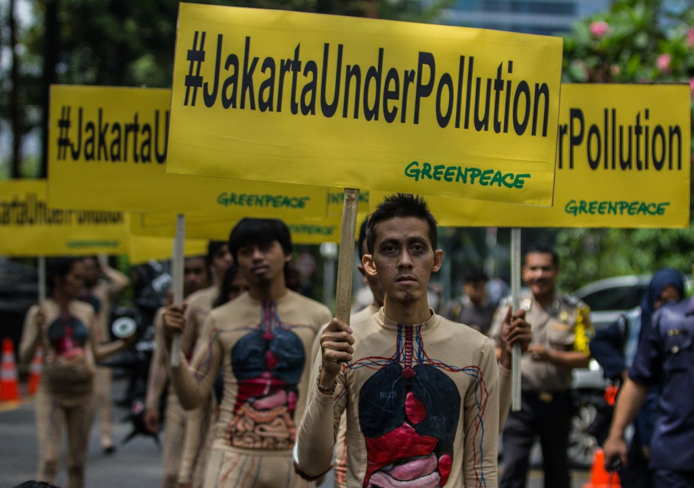
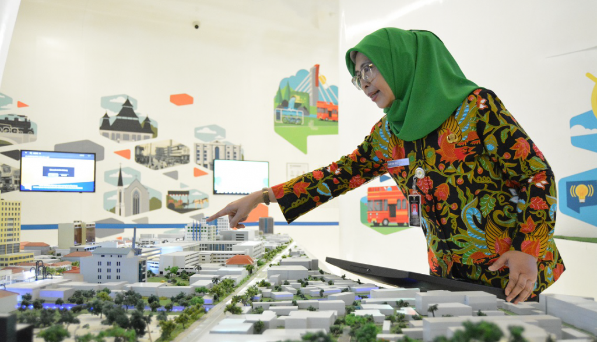
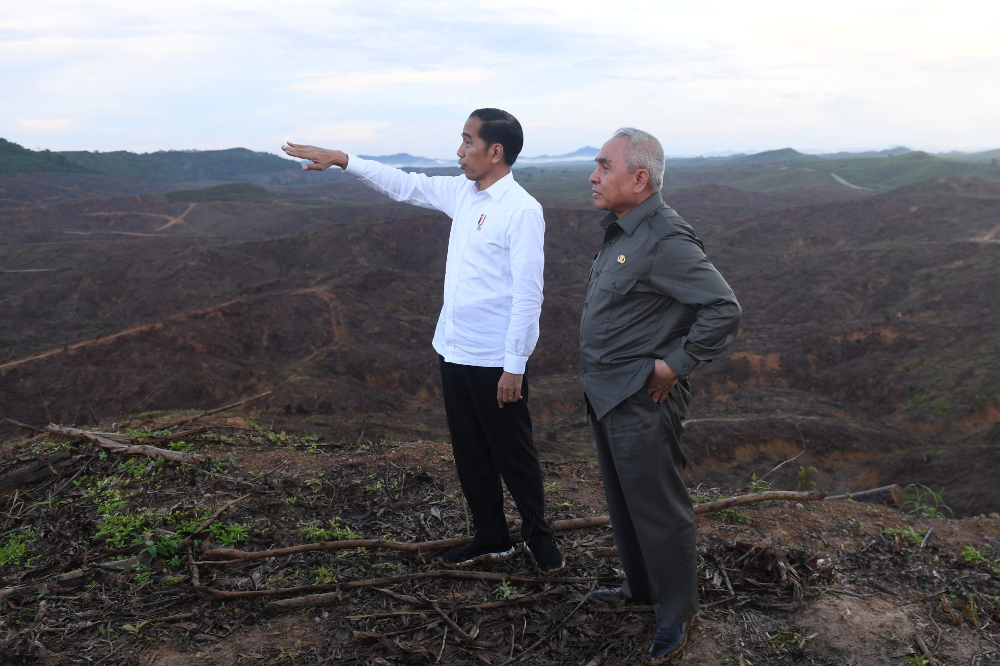
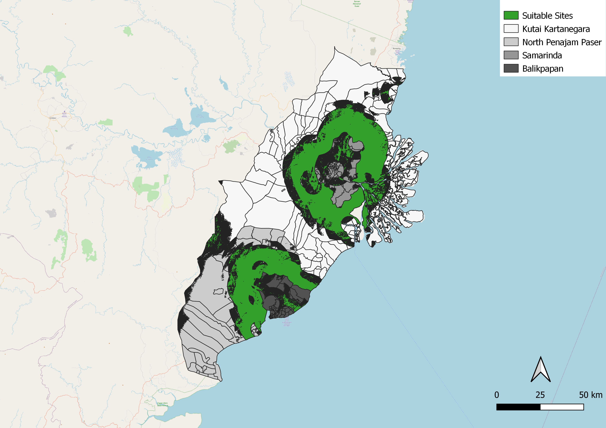
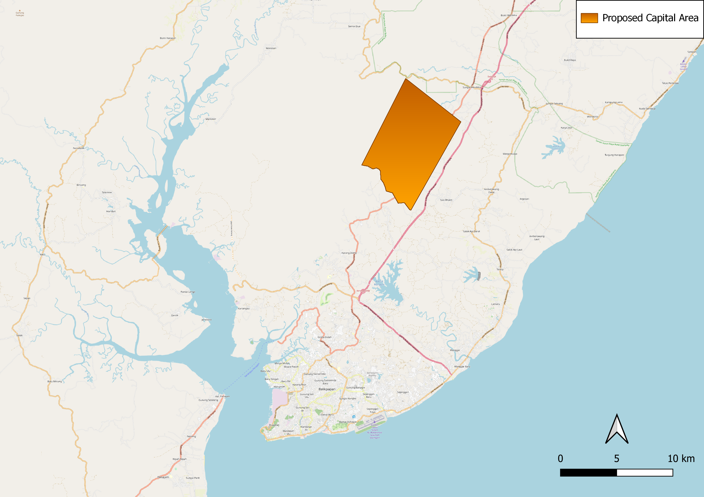
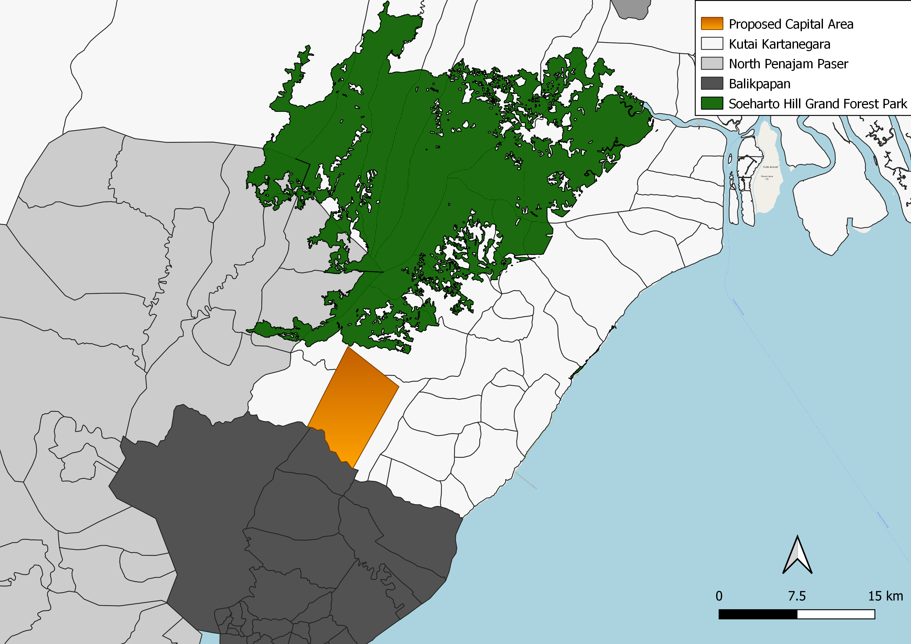
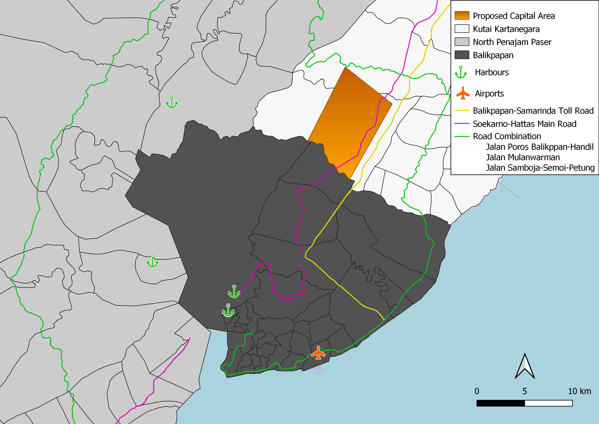

```{r setup, include=FALSE}
knitr::opts_chunk$set(echo = FALSE)
```
## 3 Site Selection
<p style="text-align: justify;">For this page, we will seek to understand the needs of different stakeholders and conduct site suitability analysis to find an appropriate location for the new capital city.</p>

## 3.1 Interest Groups
<p style="text-align: justify;">In this section, we will seek to understand the needs of different stakeholders and conduct site suitability analysis to find an appropriate location for the new capital city.</p>

### Environmental Groups


<p style="text-align:center"><em>Figure 25: Greenpeace rallying against Air Pollution in Jakarta (2017)</em></p>

<p style="text-align: justify;">The decision to relocate the capital has been met with a significant degree of resistance by environmental groups such as Greenpeace Indonesia (Source). Concerns include increasing the risk of fires due to Borneo’s composition of large swathes of flammable peatlands, which could result in astronomical quantities of greenhouse gas emissions when these lands are cleared. Practices of mining and creation of palm oil plantations are already causing massive amounts of deforestation, and the need for further forest clearing to build the new capital city would only exacerbate the issue of deforestation. Such a practice also places various species native species of animals including Orangutans at risk through habitat loss.</p>


### Developers and Urban Planners


<p style="text-align:center"><em>Figure 26: Ahyani Raksanagara, head of the Department of Development Planning and Research in the city government of Bandung (2019)</em></p>

<p style="text-align: justify;">The Relocation of the capital is one of Indonesia’s “most ambitious plans” to date. The current proposal incorporates contemporary designs and aims to modernize the infrastructure of the proposed site (Source). However, some ideas such as the building of a new palace have been met with widespread criticism by citizens of East Kalimantan. With this in mind, Developers have been meticulous in their decision-making process and make prudent choices to ensure the overall sustainability of the project. These choices include analysing the proposed concept of creating a ‘smart, clean and green’ city, allowing nature and the city to co-exist harmoniously (Source).</p>

<p style="text-align: justify;">As urban planners themselves their main focus would squarely be on ensuring that the new proposed site is easy to build on with relatively consistent terrain and minimal changes to elevation. To ensure the long term safety and security of the city, urban planners would also need to ensure that infrastructure that is being developed is resistant to shock from natural disasters.</p>

### Politicians and Government Officials


<p style="text-align:center"><em>Figure 27: President Joko Widodo (left) surveying potential sites for the new capital in East Kalimantan (2020)</em></p>

<p style="text-align: justify;">Jokowi’s Government has championed the movement of the capital to Jakarta. To ensure the longevity and long term success of the capital, the proposed site has to be economically viable and bolster the productivity of east kalimantan for all Indonesians. The estimated cost of the project is roughly $32.16 billion, with 80% expected to come from private funding; it has been heavily criticized for putting a strain on government reserves and plunging Indonesia into greater debt (source). These concerns will be very much on the minds of government officials who need to garner support from their constituents by guaranteeing a brighter future for them through the new capital plan.</p>

## 3.2 Requirements

<p style="text-align: justify;">This section covers the requirements that we have to take into consideration when planning the chosen site for the capital. </p>

### 1. Presence of Slopes

<p style="text-align: justify;">The presence of steep slopes can pose several issues, which include it being challenging for buildings to be built on top of the land. Experts have assessed that slopes with elevation above 15° (source) would incur significant costs and difficulty in construction, with heavy equipment limiting access, increasing time and costs needed due to greater complexity. Such circumstances should be avoided given the already large estimate of the project’s costs and Indonesia’s unstable fiscal position (source). Another disadvantage is that steep slopes aggravate the impact of soil erosion (source) caused by deforestation, which may lead to higher incidences of landslides, compromising city infrastructure and the safety of residents</p>

### 2. Proximity to Natural Forests

<p style="text-align: justify;">The island of Borneo has seen massive deforestation due to the expansion of industrialized plantations over the last few decades (Source). To conserve the natural biodiversity of East Kalimantan, it is essential for the new capital to avoid forested areas within the study area. </p>

### 3. Proximity to Urban Settlements

<p style="text-align: justify;">The new capital should be close but not directly located in major urban settlements, such as Balikpapan and Samarinda. As shown in figures 9 and 11, services such as banks and trading posts are predominantly located in Balikpapan and Samarinda, and it's ideal for the new capital to be close to centres of economic activity. </p>

### 4. Proximity to Airports / Seaports

<p style="text-align: justify;">Currently, Balikpapan is the city with the largest economy and the busiest airport and seaport in Kalimantan (source) There are various seaports located around Balikpapan as well as Samarinda , as shown in figure 21. Ensuring that the city is within reasonable proximity to these places will allow easy access to the capital by the rest of the world, and that trade and economic activities can continue to be sustained. However the new capital should not be too close to these locations to avoid noise pollution that could affect residents in the new capital.</p>

### 5. Accessibility to Roads / Transport Networks

<p style="text-align: justify;">With the new capital constructed with the purpose of relieving pressure on Jakarta as Indonesia’s capital, characteristics such as accessibility and connectivity to the rest of Indonesia should be retained. Adequate road connectivity entails various benefits such as economic growth, greater supply chain efficiency with lowered costs of transportation. With improved productivity, this translates into higher standards of living for the people. This also opens job opportunities for contributions towards the transportation system, and a well integrated transportation system serves as a representation of advancements made by Indonesia (source). From figure 19, we see that there are multiple road networks connected to Balikpapan, with the Balikpapan-Samarinda Highway connecting Balikpapan, Samarinda and the proposed new capital, which will bring improved connectivity and economic growth (source). </p>

### 6. Natural Disaster Risk Areas

<p style="text-align: justify;">The main consideration for this requirement would be positioning the site off the coastlines due to the underlying risk of undersea volcanoes. There have been discoveries of undersea volcanoes documented in Indonesia, including a 3000m volcano located off Sulawesi Island, east of Borneo. (source) Any eruption can result in the triggering of tsunamis, (source) hence the site should be located a certain distance from coastlines to minimize the risk of tsunamis encroaching within the new site. </p>

### 7. Forest Fire Risk Areas

<p style="text-align: justify;">As shown in Figure 24, various areas scattered throughout the study area are prone to forest fires. It is imperative that the new site be located a certain distance away from such areas to minimize harmful smoke inhalation to residents (source), which affects one’s lungs detrimentally, and reduce risks of structural damage to buildings (source). A blazing wildfire too close to the new capital would not only incur massive financial and structural losses, but the health of the residents would be greatly compromised as well. Any trigger of mass evacuations would render many homeless. </p>

## 3.3 Multi-Criteria Analysis and Threshold
<p style="text-align: justify;">In this section, a weightage for each of these requirements will be given using Multi Criteria Analysis, based on the needs of the different interest groups.</p>
<p></p>


<p style="text-align:center"><em>Figure 28: Multi-Criteria Evaluation</em></p>
<p> </p>


<p style="text-align:center"><em>Figure 29: AHP weightage for each requirement</em></p>

<p style="text-align: justify;">From Figure 28 we have conducted a pairwise comparison to ascertain the relative importance of each requirement. As seen in Figure 29, after calculating the AHP scores we have attained a ranking of requirements as follows:</p>

1. Forest Fire Risk Areas (Highest Importance)
2. Presence of Slopes
3. Natural Disaster Risk Areas
4. Accessibility to Roads / Transport Networks
5. Proximity to Urban Settlements
6. Proximity to Airports / Seaports
7. Proximity to Natural Forests (Lowest Importance)

<p style="text-align: justify;">For our chosen threshold, we decided to use a value of <strong>0.4</strong> as the standard to define if a site is suitable based on the aggregation of the score of these features. Our rationale is that given the number of requirements that need to be taken into consideration, a threshold of <strong>0.4</strong> would be adequate for site suitability, and is still reasonably high to ensure that our chosen site meets the needs of our interest groups as specified in 3.1. For breakdown of our site suitability analysis, please refer to Project Guide 4.</p>

## 3.4 Chosen Sites and Considerations
<p style="text-align: justify;">In this section we will walk through the suitable sites derived from our AHP analysis and touch on our chosen site for Indonesia’s new capital</p>

### 3.4.1 Suitable Sites


<p style="text-align:center"><em>Figure 30: Suitable Sites (1:1270000)</em></p>

<p style="text-align: justify;">After conducting our AHP analysis, we managed to obtain locations of suitable sites within our study area as seen on Figure 30. One important criteria is that the capital should be <strong>4500 - 5500 hectares</strong> in size. Within this in mind we used the trim/extend tool found in Qgis as well as the Measuring tool to carve out an area of a suitable size. For finer details of how this was conducted please refer to Project Guide 4.</p>

### 3.4.1 Ibu Kota Negara (Indonesia's New Capital)


<p style="text-align:center"><em>Figure 31: Planned capital area with OSM Map (1:250 000)</em></p>

<p style="text-align: justify;">As seen in Figure 31, the location of our chosen site for the proposed capital lies within Karya Merdeka and neighbouring Sungai Air Merdeka. The proposed capital area is reasonably far from the coast and major rivers to the south-west, keeping it relatively safe from the risk of natural disasters like tsunamis that can be caused by undersea volcanoes.</p>

<p></p>



<p style="text-align:center"><em>Figure 32: Planned capital area with Soeharto Hill Grand Forest Park (1:350 000)</em></p>

<p style="text-align: justify;">The proposed capital area also does not infringe on Soeharto Hill Grand Forest which remains one of the largest bastions for preserving natural biodiversity in East Kalimantan. Furthermore the location of the proposed capital which lies in close proximity to Soeharto Hill Grand Forest helps to empower the vision of creating a smart, green and livable city, allowing residents to appreciate and live in close connection to nature.</p>

<p></p>



<p style="text-align:center"><em>Figure 33: Planned capital area with transport network (1:250 000)</em></p>

<p style="text-align: justify;">The proposed capital is also highly connected and accessible, as seen in Figure 33, It does not intersect major settlements and lies on the border of Kota Balikpapan, a major hub for commerce and industry within East Kalimantan. It also overlaps The Soekarno-Hattas Main Road which passes through all four regencies of Kota Samarinda, Kota Balikpapan, Kutai Kartanegara and North Penajam Paser and the Balikpapan-Samarinda Toll Road which is a highway connecting Kota Samarinda and Kota Balikpapan. The extensive road network also links the proposed capital area to Sultan Aji Muhammad Sulaiman Sepinggan International Airport in Kota Balikpapan and a number of Sea ports. This puts the proposed capital in a prime location to help spur the economic development and progress of East Kalimantan.</p>

## 4 Conclusion and Future Works

<p style="text-align: justify;">Overall, we are confident in our recommended site for Indonesia’s new capital (Ibu Kota Negara). It lies in a highly connected and accessible location which is safe from natural disasters and does not require major habitat destruction, helping to preserve the natural biodiversity of East Kalimantan.</p>

<p style="text-align: justify;">However, we also recognized that our analysis is limited. It would be helpful to have a proper discussion with Government officials to ascertain the relative importance of each requirement during Multi-criteria analysis. Furthermore, we can consider enlisting the help of residents of East Kalimantan who can offer a more unique and nuanced perspective for the location of the proposed capital. These key stakeholders may provide insights that we may have overlooked.</p>

<p style="text-align: justify;">For future work, our team would recommend the use of geological layering which provides data about the soil series of proposed sites. This Data can be used to inform decision making by architects and urban developers when they are designing buildings and infrastructure, helping to ensure that the material used in construction is of the right quality and consistency.</p>

<p style="text-align: justify;">Finally, we can also explore spatiotemporal analysis. This will allow planners to identify patterns over time and take actions accordingly. For example, because of its location at the equator, East Kalimantantan is affected by monsoon which is a seasonal change of wind patterns and changes in precipitation. Accounting for these climatic shifts over the years in building up the new capital area, is essential for the long term longevity for the city.</p>
